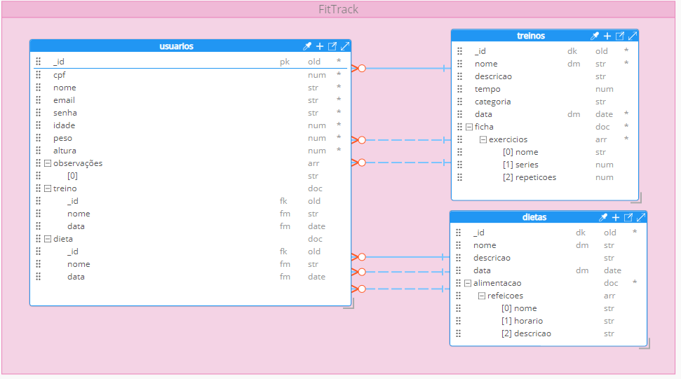
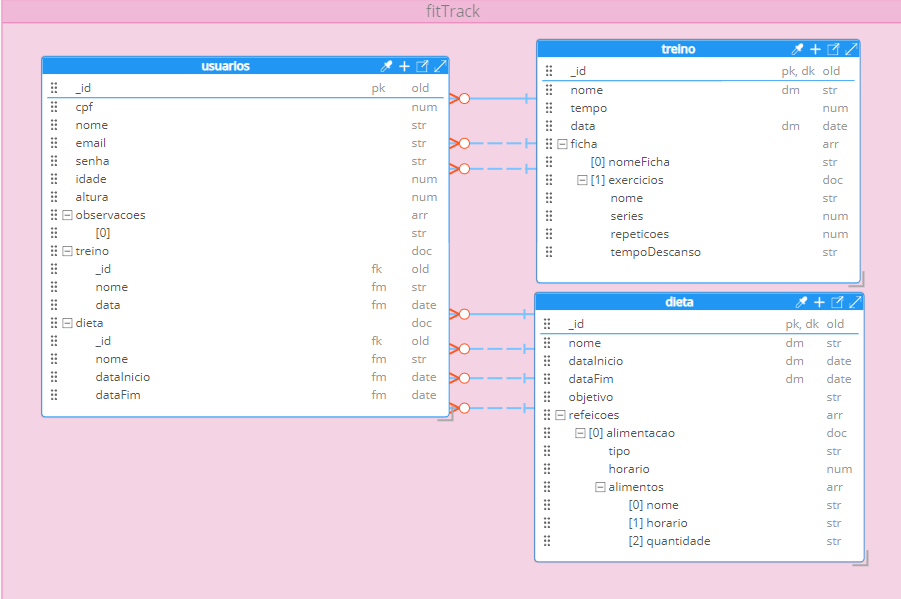

# 📦 Fit Track

API REST para gerenciamento de usuários, treinos e dietas, com foco em pessoas que buscam acompanhar seus hábitos de vida saudável.


## 🎯 Objetivo do Projeto

O projeto **Fit Track** foi desenvolvido com o objetivo de facilitar o controle personalizado de treinos e dietas para diferentes usuários. Através dessa API Rest, é possível:

- Cadastrar e gerenciar perfis de usuários.
- Associar treinos e dietas específicas a cada usuário.
- Registrar detalhes como exercícios, tempos de descanso, refeições, horários.

Essa API pode servir como base para uma aplicação front-end mobile ou web, facilitando a organização de rotinas fitness personalizadas.
<<<<<<< HEAD
### Modelagem do  Hackloade
=======
### Modelagem

## 
>>>>>>> 06cbd0b8c9753e07b184c789d1420c6d6062aa94

## 


## 🧠 Sobre a Modelagem

A modelagem foi pensada com foco em **relacionamentos entre entidades** e **simplicidade de expansão futura**. Os principais modelos são:

- **Usuário (`User`)**: contém dados pessoais e referência a um treino e uma dieta específicos.
- **Treino (`Treino`)**: lista de exercícios, tempo, categoria (ex: força, resistência), etc.
- **Dieta (`Dieta`)**: conjunto de refeições distribuídas por horários, com foco nutricional.

Cada modelo é independente, mas conectado por meio de incorporação (`treino_id`, `dieta_id`), facilitando tanto a manutenção quanto o reaproveitamento de treinos e dietas entre usuários.

### Regras de Negócio 
CPF e senha não podem ser alterados após o cadastro por questões de segurança e integridade dos dados.

Datas (como data de criação da dieta ou treino) devem ser inseridas manualmente pelo usuário, promovendo maior controle sobre o registro histórico.

O campo "observações" no modelo de usuário é destinado ao registro de pendências médicas, como lesões ou doenças crônicas, sendo importante para orientar a personalização de treinos e dietas.

---

## 🗂 Estrutura do Projeto

```
├── backend
│   ├── controllers        # Camada de controle das rotas
│   ├── models             # Definição dos modelos
│   ├── routes             # Arquivo de rotas da aplicação
│   └── server.js          # Arquivo principal da aplicação
├── assets  
    ├── modelgagem.png     # Modelagem da documentação
├── package.json           # Gerenciador de dependências
├── package-lock.json      # dependências do projeto
├── node_modules           # dependências do projeto
<<<<<<< HEAD
=======
├── assest                 #Imagem da Modlelagem 
>>>>>>> 06cbd0b8c9753e07b184c789d1420c6d6062aa94
├── README.md              # Documentação do projeto

```
## 🔗 Como Executar o Projeto

### ✅ Pré-requisitos

- Node.js
- npm
- Git
- Visual Studio Code
- Cliente HTTP (Insomnia, Postman ou Thunder Client)

#### Neste caso foi utilizado o Postman, mas fique á vontade de para outro Cliente HTTP.
---

### 💻 Execução 

1. Clone o repositório:
```bash
git clone https://github.com/usuario/nome-do-projeto.git
```

2. Acesse a pasta do projeto:
```bash
cd backend
```

3. Instale as dependências:
```bash
npm install
```

4. Inicie o servidor:
```bash
node server.js
```

Se estiver tudo certo, verá no terminal:
```
Servidor rodando em http://localhost:5000
Conectado ao Atlas
```
#### Se ocorrer algum erro verifique se você está na raiz do projeto e execute novamente

<<<<<<< HEAD
#### Utilize essa URL no Postman como as rotas:
=======
---

### 🌐 Execução Remota

Você pode acessar a API diretamente pelo back-end hospedado no Render:

```
https://fittrack-mq85.onrender.com
```

Utilize essa URL no  Postman com as rotas:
>>>>>>> 06cbd0b8c9753e07b184c789d1420c6d6062aa94
- `/user`
- `/treino`
- `/dieta`

<<<<<<< HEAD
## 🌐 Back-end Remoto
Você também pode acessar o back-end hospedado remotamente pela platoforma Render:
```
https://fittrack-api.onrender.com
```
Utilize essas URLs como base no Postman:
```
https://fittrack-api.onrender.com/user
=======
### 📝 3. Crie uma nova requisição
Abra o Postman

Clique em "New" > "HTTP Request"

Escolha o método da requisição (ex: POST, GET, PUT, DELETE)

No campo de URL, insira o endpoint. Exemplo para criar um treino:
```
https://fittrack-mq85.onrender.com/treino
```
ou 
```
http://localhost:5000/treino
```


>>>>>>> 06cbd0b8c9753e07b184c789d1420c6d6062aa94

https://fittrack-api.onrender.com/treino

https://fittrack-api.onrender.com/dieta
```

## 📫 Como Fazer Requisição no Postman 
### 🧪 Exemplo: Criar um novo treino (POST /treino)
#### ✅ Pré-requisitos
- Postman instalado (ou versão web).
- Servidor da API em execução localmente (http://localhost:5000), replique se for caso do back end remoto


### 🚀 Passo a Passo
Abra o Postman.

Clique em "New" > "HTTP Request".

No campo de URL, digite:
```bash
http://localhost:5000/treino
```
No menu suspenso à esquerda da URL, selecione o método POST.

Clique na aba "Body" abaixo da URL.

Marque a opção "raw" e selecione "JSON" no menu ao lado.

Cole o seguinte JSON de exemplo:
```bash
{
  "nome": "Treino A - Superior",
  "descricao": "Treino focado nos músculos superiores",
  "tempo": "45 min",
  "categoria": "Força",
  "data": "2025-05-20",
  "exercicios": [
    {
      "nome": "Supino reto",
      "series": 4,
      "repeticoes": 12,
      "descansoSeries": "1min30s"
    },
    {
      "nome": "Crucifixo",
      "series": 3,
      "repeticoes": 10,
      "descansoSeries": "1min20s"
    }
  ]
}
```
### Clique em "Send"

### ✅ Resposta esperada
Se a requisição for bem-sucedida, você verá uma resposta no painel inferior com status 201 Created e o JSON do treino criado.

## 🔁 Rotas e Exemplo de Dados


- `POST /treino` – Criar novo treino
- `GET /treino` – Listar treino
- `PUT /treino/:id` – Atualizar treino
- `DELETE /treino/:id` – Deletar treino

### 🏋️ Treinos
### Metódo POST
**Exemplo JSON:**
```json
{
  "nome": "Treino A - Superior",
  "descricao": "Treino focado nos músculos superiores",
  "tempo": "45 min",
  "categoria": "Força",
  "data": "2025-05-20",
  "exercicios": [
    {
      "nome": "Supino reto",
      "series": 4,
      "repeticoes": 12,
      "descansoSeries": "1min30s"
    },
    {
      "nome": "Crucifixo",
      "series": 3,
      "repeticoes": 10,
      "descansoSeries": "1min20s"
    }
  ]
}

```
### Metódo PUT
```json
{
  "nome": "Treino B - Inferiores",
  "descricao": "Treino focado nos músculos inferiores",
  "tempo": "45 min",
  "categoria": "Força",
  "data": "2025-05-20",
  "exercicios": [
    {
      "nome": "agachamento livre",
      "series": 4,
      "repeticoes": 12,
      "descansoSeries": "1min30s"
    },
    {
      "nome": "Legpress",
      "series": 3,
      "repeticoes": 10,
      "descansoSeries": "1min20s"
    }
  ]
}

```
### 🥗 Dietas
### Metodo POST
**Exemplo JSON:**
```json
{
  "nome": "Dieta Hipercalórica",
  "descricao": "Alta ingestão calórica para ganho de massa",
  "data": "2025-05-20",
  "refeicoes": [
    {
      "horario": "8:00",
      "descricao": ["Ovos", "Pão integral", "Suco de laranja"]
    },
    {
      "horario": "12:00",
      "descricao": ["Arroz", "Feijão", "Frango grelhado", "Salada"]
    }
  ]
}
```
### Metodo PUT
```json
{
  "nome": "Dieta emagrecimento",
  "descricao": "Baixa ingestão calórica para perda de peso",
  "data": "2025-05-20",
  "refeicoes": [
    {
      "horario": "8:00",
      "descricao": ["Ovos", "Pão integral", "Suco de laranja"]
    },
    {
      "horario": "12:00",
      "descricao": ["Arroz", "Feijão", "Frango grelhado", "Salada"]
    }
  ]
}
```

### 👤 Usuários
### Metodo POST
**Exemplo JSON:**
```json
{
  "nome": "João da Silva",
  "cpf": "12312312312",
  "email": "joao@email.com",
  "senha": "123456",
  "idade": 25,
  "altura": 1.75,
  "observações": "lesão no joelho direito",
  "treino_id": "treino123",
  "dieta_id": "dieta123"
}
```
### Metodo PUT 
```json
{
  "nome": "João da Silvas",
  "email": "joaoSilva@email.com",
  "altura": 1.85,
  "observações": "Sem restrições",
}
```

## 🛠 Tecnologias Utilizadas
- Node.js
- Express
- MongoDB (Atlas)
- Mongoose
- Postman (testes das rotas)

## 👥 Integrantes do Projeto
Bruno Araujo

Guilherme do Carmo

Henrique Lucila Bicato

Henzo Bragas Da Silva

Kaue Gahetti

<<<<<<< HEAD
=======
---
>>>>>>> 06cbd0b8c9753e07b184c789d1420c6d6062aa94
