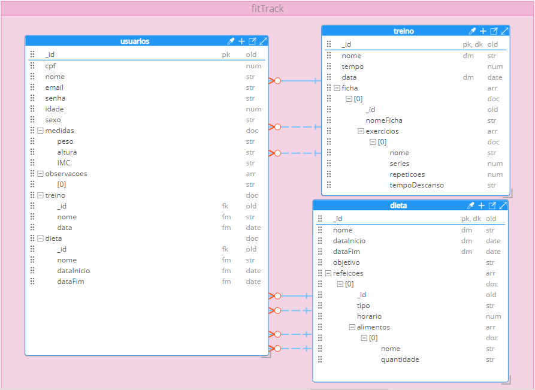

# 📦 Fit Track

API REST para gerenciamento de usuários, treinos e dietas, com o foco na performance na requisições, utilizando banco de dados não relacional.

## 🎯 Objetivo do Projeto

O projeto **Fit Track** foi desenvolvido com o objetivo de facilitar o controle personalizado de treinos e dietas, utilizando um banco de dados NoSQL, como o MongoDB, com hospedagem em nuvem através do **MongoDB Atlas**.

Com esta API, é possível:

- 📌 Cadastrar e gerenciar perfis de usuários

- 🏋️ Associar treinos específicos a cada usuário

- 🍽️ Vincular dietas personalizadas

- 📋 Registrar detalhes de treinos, como fichas e exercícios

- 🥗 Registrar detalhes de dietas, como refeições, horários e alimentos

## 🧠 Sobre a Modelagem

## 

A modelagem foi pensada com foco em **incorporação documentos** para garantir uma maior performance nas requisições, retornando ao usuário apenas os campos essenciais, como `id`, `nome` e `datas`.

## **Coleção: `usuarios`**

#### Campos:

- \_id: Identificador único do usuário.
- CPF: Número do CPF.
- nome: Nome completo.
- email: Endereço de e-mail.
- senha: Senha do usuário.
- idade: Idade do usuário.
- sexo: Gênero do usuário.
- medidas (subdocumento):
  - peso
  - altura
  - IMC: Cálculo pelo BackEnd
- observacoes (array): Observações médicas

- Treino (subdocumento):

  - \_id: Referência ao treino.
  - nome: Nome do treino.
  - data: Data do início do treino: (ex: `10/01/2025` )

- dieta (subdocumento):
  - \_id: Referência à dieta.
  - nome: Nome da dieta.
  - dataInicio: Data de início. (ex: `10/01/2025` )
  - dataFim: Data de término. (ex: `10/01/2025` )

## 🏋️ **Coleção: `treino`**

Armazena planos de treino independentes dos usuários.

#### Campos:

- \_id: Identificador único do treino.

- nome: Nome do plano de treino.

- tempo: Duração do treino (ex: `45min`).

- data: Data da criação (ex:`10/01/2025`)

- ficha (array de documentos):

  - \_id: Identificador da ficha.

  - nomeFicha: Nome da ficha.

  - exercicios (array de documentos):
  - nome: Nome do exercício.

  - series: Quantidade de séries. (ex: `3`)

  - repeticoes: Número de repetições. (ex: `12`)

  - tempoDescanso: Tempo de descanso entre as séries. Dado em minutos e segundos (ex: `1min20s`)

## 🥗 **Coleção: `dieta`**

Armazena as dietas personalizadas dos usuários, coleção independente dos usuários

### Campos:

- \_id: Identificador único da dieta.

- nome: Nome do plano alimentar.

- dataInicio: Data de início da dieta.

- dataFim: Data de término da dieta.

- objetivo: Objetivo da dieta (ex: emagrecer, ganhar massa, etc.).

- refeicoes (array de documentos):

  - \_id: Identificador da refeição.

  - tipo: Tipo da refeição (ex: café da manhã, almoço).

  - horario: Horário da refeição formato 24h (ex: `08:00`)

  - alimentos (array de documentos):

  - nome: Nome do alimento.
  - quantidade: Quantidade (gramas).

## 📋 Regras de Negócio

- O campo **IMC** (collection `usuario`) é calculado automaticamente pelo backend com base em `peso` e `altura`. O resultado é arredondado para **duas casas decimais**.

- O campo **tempo** (na coleção `treino`) deve seguir o padrão `45min` garante **uniformidade na inserção e leitura dos dados**, facilitando a manipulação e visualização posterior.

- O campo **horario** (na coleção `dieta`) deve estar no formato 24 horas, como `08:00`, para evitar ambiguidades entre manhãs e tarde/noite(ex: `08:00` vs `8:00PM`). Permitindo maior compatibilidade com bibliotecas de data/hora, além de simplificar cálculos de horários e notificações.

- **Datas** (nas collections `dieta` e `treino` ex: `início/fim` de dieta ou `data` de treino) devem ser inseridas manualmente o formato **brasileiro** de data (`DD/MM/YYYY`).

- O campo **observacoes** (na coleção `usuarios`) é destinado a **pendências médicas**, como lesões, doenças crônicas e restrições. Caso não haja nenhuma pendência, o preenchimento com `sem restrições` evita campos nulos e permite que todos os usuários sigam um padrão uniforme de documentação médica padronizada. Isso é útil para filtros e validações futuras.


## 🗂 Estrutura do Projeto

O projeto foi desenvolvido em módulos para facilitar a manutenção e evolução do código.

```
├── assets
│    ├── modelagem.png     # imagem da modelagem da documentação
├── backend
│   ├── controllers        # Lógica de controle das requisições
│   ├── models             # Definição dos esquemas/modelos do MongoDB
│   ├── routes             # Arquivos com as rotas da aplicação
│   └── server.js          # Arquivo principal da aplicação
├── package.json           # Gerenciador de dependências e scripts do projeto
├── package-lock.json      # Arquivo de bloqueio de versões das dependências
├── node_modules           # Diretório onde ficam as dependências instaladas
├── README.md              # Documentação do projeto

```

## 🔗 Como Executar o Projeto

### ✅ Pré-requisitos

- [Node.js](https://nodejs.org/)
- [Git](https://git-scm.com/)
- [Visual Studio Code](https://code.visualstudio.com/)
- Um cliente HTTP (como **Postman**, **Insomnia** ou **Thunder Client**)

#### 💡 Neste projeto foi utilizado o Postman, mas você pode utilizar o cliente HTTP de sua preferência.

---

### 💻 Execução Local

1. Clone o repositório:

```bash
git clone https://github.com/HenzoBragas/FitTrack.git
```

2. Acesse a pasta do projeto:

```bash
cd FitTrack
```

3. Navegue até o diretório do backend:

```bash
cd backend
```

4. Instale as dependências:

```bash
npm install
```

5. Inicie o servidor:

```bash
node server.js
```

Se estiver tudo certo, verá no terminal:

```bash
Servidor rodando em http://localhost:5000
Conectado ao Atlas
```

#### ⚠️ Caso ocorra algum erro, verifique se você está no diretório correto e tente novamente.

## 📬 Endpoints da API (para uso no Postman ou outro cliente HTTP)

- `/user`
- `/treino`
- `/dieta`

## 🌐 Back-end Hospedado (Render)

Você também pode testar a API através do ambiente hospedado na plataforma Render:

```bash
https://fittrack-mq85.onrender.com
```

Rotas disponíveis no ambiente online:

```bash
https://fittrack-mq85.onrender.com/user

https://fittrack-mq85.onrender.com/treino

https://fittrack-mq85.onrender.com/dieta
```

#### ⚠️ Lembre-se de copiar e aplicar tudo o que foi feito no back-end local também no servidor remoto.

## 📫 Como Fazer Requisição no Postman

### 🔁 Rotas Disponíveis - Treinos

| Método | Rota          | Descrição               |
| ------ | ------------- | ----------------------- |
| POST   | `/treino`     | Criar novo treino       |
| GET    | `/treino`     | Listar todos os treinos |
| PUT    | `/treino/:id` | Atualizar um treino     |
| DELETE | `/treino/:id` | Remover um treino       |

---

## 🧪 Exemplo: Criar um Novo Treino (POST /treino)

#### ✅ Pré-requisitos

- Postman instalado.
- Servidor da API em execução localmente em `http://localhost:5000`( ou use o backend remoto em `https://fittrack-api.onrender.com`).

## 🚀 Passo a Passo

### 1. Abra o Postman.

#### 2. Clique em **"New"** > **"HTTP Request"**.

No campo de URL, digite:

```bash
http://localhost:5000/treino
```

#### 4. No menu suspenso à esquerda da URL, selecione o método `POST`

#### 5. Clique na aba **"Body"** abaixo da URL.

#### 6. Marque a opção `raw` e selecione `JSON` no menu ao lado.

#### 7. Cole o seguinte corpo da requisição:

```JSON
{
  "nome": "Treino ABC",
  "tempo": "45min",
  "data": "20/05/2025",
  "fichas": [
    {
      "nomeFicha": "A - Peito e Tríceps",
      "exercicios":
      {
        "nome": "Supino reto",
        "series": 4,
        "repeticoes": 12,
        "tempoDescanso": "1min30s"
      },
      {
        "nome": "Crucifixo",
        "series": 3,
        "repeticoes": 10,
        "tempoDescanso": "1min20s"
      }
    }
  ]
}

```

#### ❗ Certifique-se de que o campo tempo está no formato `45min` e a data no formato `DD/MM/AAAA` conforme as regras de negócio.

#### 📝 Após criar: Copie o \_id retornado no JSON e guarde para usar como treino_id.

### 8. Clique em "Send"

### ✅ Resposta Esperada

#### Se a requisição for bem-sucedida, o Postman exibirá:

- Status: `201 Created`
- Corpo da resposta: JSON com os dados do treino criado

---

### GET `/treino`

Apenas altere método `POST` para `GET`

- Método: GET

- URL:
  `http://localhost:5000/treino`

- ✅ Retorna todos os treinos cadastrados.

---

### ✏️ PUT /treino/:id

Apenas altere método `GET` para `PUT`

- URL:
  `http://localhost:5000/treino/<id_do_treino>
`

Substitua `id_do_treino` pelo valor do \_id correspondente ao treino que deseja atualizar.

### 🧪 Corpo da Requisição (JSON)

#### Envie apenas os campos que deseja atualizar:

```JSON
{
  "tempo": "60min",
  "data": "25/05/2025"
}
```

### ✅ Resposta Esperada

Status: 200 OK

JSON com os dados atualizados do treino.

---

### ❌ DELETE /treino/:id

Método: DELETE

URL:

```bash
http://localhost:5000/treino/<_id_do_treino>
```

#### Substitua `id_do_treino` pelo valor do \_id correspondente ao dieta que deseja deletar.

✅ Remove uma dieta existente com base no \_id.

---

## 🔁 Rotas Disponíveis - Dietas

| Método | Rota         | Descrição              |
| ------ | ------------ | ---------------------- |
| POST   | `/dieta`     | Criar nova dieta       |
| GET    | `/dieta`     | Listar todas as dietas |
| PUT    | `/dieta/:id` | Atualizar uma dieta    |
| DELETE | `/dieta/:id` | Remover uma dieta      |

## 🧪 Exemplo: Criar uma Nova Dieta (POST /dieta)

### 🚀 Passo a Passo

#### 1. Crie uma nova requisição:

```bash
http://localhost:5000/dieta
```

#### 2. Acesse a aba `Body`, marque `raw` e escolha `JSON`.

#### 3. Cole o seguinte exemplo de dieta:

```JSON
{
  "nome": "Dieta Hipercalórica",
  "dataInicio": "10/05/2025",
  "dataFim": "10/06/2025",
  "objetivo": "ganhar massa",
  "refeicoes": [
    {
      "tipo": "Café da manhã",
      "horario": "08:00",
      "alimentos": [
        {
          "nome": "Ovos",
          "quantidade": "3 unidades"
        },
        {
          "nome": "Aveia",
          "quantidade": "2 colheres"
        }
      ]
    },
    {
      "tipo": "Almoço",
      "horario": "12:30",
      "alimentos": [
        {
          "nome": "Arroz integral",
          "quantidade": "100g"
        },
        {
          "nome": "Frango grelhado",
          "quantidade": "150g"
        }
      ]
    }
  ]
}
```

#### ❗ O campo horario deve seguir o formato 24 horas (HH:mm). Datas seguem o padrão DD/MM/AAAA.

#### 📝 Após criar: Copie o \_id retornado no JSON e guarde para usar como dieta_id.

### ✅ Resposta Esperada

#### Se a requisição for bem-sucedida, o Postman exibirá:

- Status: `201 Created`
- Corpo da resposta: JSON com os dados do dieta criada

---

### 🔍 GET /dieta

Apenas altere método `POST` para `GET`

Método: GET

URL:

```bash
http://localhost:5000/dieta
```

✅ Retorna todas as dietas cadastradas.

---

### ✏️ PUT /dieta/:id

Método: PUT

URL:

```bash
http://localhost:5000/dieta/<id_da_dieta>
```

#### Substitua `id_da_dieta` pelo valor do \_id correspondente ao dieta que deseja atualizar.

### 🧪 Corpo da Requisição (JSON)

#### Envie apenas os campos que deseja atualizar:

```JSON
{
  "tempo": "60min",
  "data": "25/05/2025"
}

```

✅ Resposta Esperada
Status: 200 OK

JSON com os dados atualizados da dieta.

---

### ❌ DELETE /dieta/:id

Método: DELETE

URL:

```bash
http://localhost:5000/dieta/<id_da_dieta>
```

#### Substitua `id_da_dieta` pelo valor do \_id correspondente ao dieta que deseja deletar.

✅ Remove uma dieta existente com base no \_id.

---

## 🔁 Rotas Disponíveis – Usuário

| Método   | Rota        | Descrição                            |
| -------- | ----------- | ------------------------------------ |
| `POST`   | `/user`     | Cadastrar um novo usuário            |
| `GET`    | `/user`     | Listar todos os usuários cadastrados |
| `PUT`    | `/user/:id` | Atualizar os dados de um usuário     |
| `DELETE` | `/user/:id` | Remover um usuário do sistema        |

### 🧪 Exemplo: Criar um Novo Usuário (POST /user)

### 🚀 Passo a Passo

#### 1. Crie uma nova requisição:

```bash
http://localhost:5000/user
```

#### 2. Acesse a aba `Body`, marque `raw` e escolha `JSON`.

#### 3. Cole o seguinte exemplo de usuario:

```JSON
{
  "nome": "Ana Lima",
  "cpf": "98765432100",
  "email": "ana.lima@example.com",
  "senha": "senha123",
  "idade": 28,
  "sexo": "Feminino",
  "medidas": {
    "peso": 65,
    "altura": 1.68
  },
  "observacoes": ["sem restrições"],
  "treino_id": "",
  "dieta_id": ""
}
```

### ⚠️ Atenção

#### 🔗 Os campos treino_id e dieta_id devem corresponder exatamente aos valores de \_id retornados ao criar um treino e uma dieta.

- ⚠️ Copie os \_id gerados nas requisições de criação de treino e criação de dieta.

- Cole esses valores nos campos treino_id e dieta_id ao criar um usuário.

- Isso garante que o usuário será corretamente associado ao treino e à dieta.

#### ℹ️ O campo IMC é calculado automaticamente pelo backend com base no peso e altura.

### 🔍 GET /user

#### Método: GET

URL:

```bash
http://localhost:5000/user
```

#### ✅ Retorna todos os usuários cadastrados.

---

### ✏️ PUT /user/:id

#### Método: PUT

URL:

```bash
http://localhost:5000/user/<id_do_usuario>
```

### 🧪 Corpo da Requisição (JSON)

#### Envie apenas os campos que deseja atualizar:

#### Substitua `id_do_usuario` pelo valor do \_id correspondente ao usuario que deseja atualizar.

```JSON
{
  "nome": "João Silva"
  "email": "joao@email.com"
}

```

#### ✅ Resposta Esperada

#### Status: 200 OK

#### ✅ Atualiza os dados de um usuário específico.

---

### ❌ DELETE /dieta/:id

Método: DELETE

URL:

```bash
http://localhost:5000/user/<id_do_usuario>
```

#### Substitua `id_do_usuario` pelo valor do \_id correspondente ao usuario que deseja deletar.

✅ Remove uma dieta existente com base no \_id.

---

## 🛠 Tecnologias Utilizadas

### 💻 Backend

- **Node.js**

- **Express.js**

- **MongoDB Atlas**

- **Mongoose**

### 📩 Testes de Requisição

- Postman

### 🌍 Deploy e Hospedagem

- Render

## 👥 Integrantes do Grupo

- #### Bruno Araújo Machado
- #### Guilherme Carmo Tavares
- #### Henrique Biciato Lucila
- #### Henzo Bragas Da Silva
- #### Kauê Righetti Cabral
